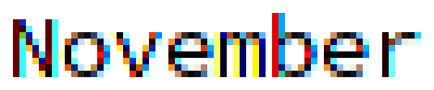
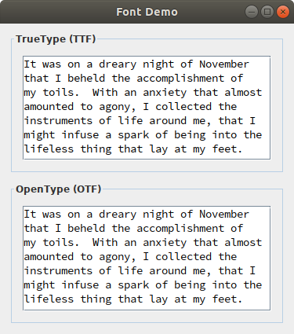

# OpenJDK FreeType Font Fix

## Report Classification

**Issue Type:** Request for Enhancement  
**Component:** Client Libraries  
**Subcomponent:** *2d:* Java 2D API  
**Operating System:** Ubuntu  
**Java Release:** 12  

## Report Details

### Synopsis

Reduce color fringes in FreeType subpixel rendering

### Description

The text in Java applications often has severe color fringes using OpenJDK on Ubuntu. I may have figured out why, along with an easy fix.

#### The History

The problem originates in decisions made by the developers of FreeType, Debian, Fedora, and OpenJDK concerning the [Microsoft ClearType patents](http://david.freetype.org/cleartype-patents.html "ClearType Patents, FreeType and the Unix Desktop: an explanation").

* In **2007**, FreeType 2.3.0 added a compiler configuration macro to the file `ftoption.h` named `FT_CONFIG_OPTION_SUBPIXEL_RENDERING`. If defined, the FreeType library includes patented ClearType techniques in its subpixel rendering.

    But there’s a catch. When the ClearType methods are enabled, the subpixel rendering is not filtered, which results in severe color fringes. Clients of the FreeType library must make an explicit call to the function `FT_Library_SetLcdFilter` to apply color filtering. The filter was disabled by default, explained one of its authors, “to avoid major surprises to existing clients, including libXft and Cairo which already perform some wacky color filtering on top of FreeType.” 

* In **2009**, Debian created a patch to FreeType 2.3.9, named `enable-subpixel-rendering.patch`, that defines the macro and enables ClearType-style rendering. The change log states, “This is considered no more or less evil than the bytecode interpreter which we also enable.” Ubuntu, based on Debian, applies the patch as well. Fedora created the same patch in 2007, named `freetype-2.3.0-enable-spr.patch`, but does not apply the patch by default.

* In **2017**, FreeType 2.8.1 included a new subpixel rendering technique, called *Harmony*, that is nearly identical in output to the ClearType technique but uses a different algorithm, avoiding the patents. FreeType now uses Harmony subpixel rendering when the ClearType methods are disabled, with no need for clients to set the LCD filter. (This would have been a good time for Debian to remove its subpixel rendering patch.) The latest Fedora Workstation 28 runs FreeType 2.8.0, which does not include Harmony.

* In **2019**, the Microsoft ClearType patents expire.

So now we have two variants of the FreeType library: one that requires a function call to set the LCD filter in Ubuntu and other distributions based on Debian, and another that doesn’t require the function call in Red Hat Enterprise Linux, Oracle Linux, and other distributions based on Fedora.

#### The Request

This is a request for OpenJDK to reduce the color fringes in subpixel rendering by [adding the following two lines](https://github.com/jgneff/openjdk-freetype/commit/0adb0e2fe6905a1a6efdd30011d32911f17c6331 "Set the default FreeType LCD filter") to `freetypeScaler.c`.

**java.desktop/share/native/libfontmanager/freetypeScaler.c**

```C
#include FT_LCD_FILTER_H
FT_Library_SetLcdFilter(scalerInfo->library, FT_LCD_FILTER_DEFAULT);
```

There are alternatives to setting the filter:

* Bundle the FreeType library by default and always use the new Harmony subpixel rendering technique. This option removes the uncertainty in the library at the expense of an additional 4.6 megabytes to the installed size—an increase of less than one percent. OpenJDK 12 even includes the latest FreeType 2.9.1, a newer version than the one found on most systems.

* Wait another year and see what changes are made to FreeType, if any, when the ClearType patents expire. This option, though, doesn’t solve the problem that users of Ubuntu and other Debian-based distributions have now.

#### The Application

To demonstrate the problem, I built four versions of the JDK from the latest OpenJDK sources. I built a version that uses the system FreeType library and another that uses the bundled FreeType library. Then I changed the OpenJDK code to set the default LCD filter and built the two versions again.

| OpenJDK     | lcdnone                | lcddefault                |
|:-----------:|:----------------------:|:-------------------------:|
| **system**  | jdk-12-system-lcdnone  | jdk-12-system-lcddefault  |
| **bundled** | jdk-12-bundled-lcdnone | jdk-12-bundled-lcddefault |

The system library is FreeType 2.8.1 in Ubuntu 18.04.1 LTS, which has the Debian patch applied (ClearType methods enabled), while the bundled library is FreeType 2.9.1 in OpenJDK 12, which uses the library default (ClearType methods disabled). I wrote a simple Java Swing application called [FontDemo](src/org/status6/FontDemo.java) that displays two text areas with the [Source Code Pro](https://github.com/adobe-fonts/source-code-pro "Monospaced font family for user interface and coding environments") font in TTF and OTF formats (the latest non-variable download). The results are shown below.

#### System FreeType Library

In this case, setting the LCD filter is critical. The screenshots below show the ClearType-style rendering without setting the LCD filter on the left (lcdnone), and after adding the change to set the filter on the right (lcddefault). The ClearType configuration macro is defined in the Ubuntu build of FreeType, so the function to set the filter returns success (0) when called and applies color filtering.

|  |  |
|:------------------------:|:--------------------------:|
| Before (system, lcdnone) | After (system, lcddefault) |

The color fringes are more visible in the images below, cropped from the TrueType font in the upper text areas and scaled by 800 percent.

|  |
|:--------------------------------------------------:|
| Before (system, lcdnone): ClearType with no fitler |

|  |
|:---------------------------------------------------------:|
| After (system, lcddefault): ClearType with default filter |

#### Bundled FreeType Library

In this case, setting the LCD filter does nothing. The screenshots below show the FreeType Harmony rendering without setting the LCD filter on the left (lcdnone), and after adding the change to set the filter on the right (lcddefault). The ClearType configuration macro is not defined in the OpenJDK build of FreeType, so the function to set the filter returns `FT_Err_Unimplemented_Feature` (7) when called and does nothing.

The two images are **identical**. 

|  |  |
|:-------------------------:|:---------------------------:|
| Before (bundled, lcdnone) | After (bundled, lcddefault) |

The two TrueType scaled images are also **identical**.

|  |
|:----------------------------------:|
| Before (bundled, lcdnone): Harmony |

|  |
|:------------------------------------:|
| After (bundled, lcddefault): Harmony |

### System / OS / Java Runtime Information

The test system is a QEMU/KVM guest virtual machine running Ubuntu 18.04.1 LTS (Bionic Beaver) with the details shown below. The display is a 27-inch Dell UltraSharp U2717D monitor with a resolution of 2560 × 1440 pixels at 109 pixels per inch.

```ShellSession
ubuntu@bionic:~$ uname -a
Linux bionic 4.15.0-36-generic #39-Ubuntu SMP
Mon Sep 24 16:19:09 UTC 2018 x86_64 x86_64 x86_64 GNU/Linux

ubuntu@bionic:~$ ldd --version
ldd (Ubuntu GLIBC 2.27-3ubuntu1) 2.27
Copyright (C) 2018 Free Software Foundation, Inc.
This is free software; see the source for copying conditions.  There is NO
warranty; not even for MERCHANTABILITY or FITNESS FOR A PARTICULAR PURPOSE.
Written by Roland McGrath and Ulrich Drepper.

ubuntu@bionic:~$ getconf GNU_LIBPTHREAD_VERSION
NPTL 2.27

ubuntu@bionic:~$ $HOME/opt/jdk-12-system-lcdnone/bin/java -version
openjdk version "12-internal" 2019-03-19
OpenJDK Runtime Environment (build 12-internal+0-adhoc.ubuntu.jdk)
OpenJDK 64-Bit Server VM (build 12-internal+0-adhoc.ubuntu.jdk, mixed mode)
```

## Additional Information

### Background

For background information on LCD filters see [Section 2.2.1](http://rastertragedy.com/RTRCh2.htm#Sec21 "Sub-Pixel Anti-Aliasing Methods compared") of *The Raster Tragedy at Low-Resolution*, which has an interactive demonstration of the filters used in ClearType (Microsoft), CoolType (Adobe), FreeType (open source), and Quartz 2D (Apple). Hover your mouse over each of the samples in the illustration to remove the filter.

### Full Test Results

Below are my test results using five versions of FreeType built first with the ClearType methods disabled (the default) and then again with them enabled. I ran all 10 libraries under OpenJDK 12, first with no LCD filter and then again after adding the code to set the default LCD filter.

For the results of these same tests with the latest OpenJFX, see the [JavaFX page](javafx.md "OpenJFX FreeType Tests") of this repository.

#### No LCD Filter

| Year | FreeType | Library | Included With    | ClearType Off | ClearType On   |
|:----:|:--------:|:--------|:-----------------|:--------------|:---------------|
| 2008 | 2.3.5    | 6.3.16  | Ubuntu 8.04 LTS  | Grayscale     | Mild fringes   |
| 2014 | 2.5.2    | 6.11.1  | Ubuntu 14.04 LTS | Grayscale     | Severe fringes |
| 2016 | 2.6.1    | 6.12.1  | Ubuntu 16.04 LTS | Grayscale     | Severe fringes |
| 2018 | 2.8.1    | 6.15.0  | Ubuntu 18.04 LTS | Harmony       | Severe fringes |
| 2019 | 2.9.1    | 6.16.1  | OpenJDK 12       | Harmony       | Severe fringes |

The OpenJDK does not set the FreeType LCD filter, so there are severe color fringes when using a FreeType library built with the ClearType methods enabled. The only reason the older FreeType 2.3.5 shows mild color fringes is because it uses full hinting, so the glyphs are simply too skinny to see their colors.

#### Default LCD Filter

| Year | FreeType | Library | Included With    | ClearType Off | ClearType On   |
|:----:|:--------:|:--------|:-----------------|:--------------|:---------------|
| 2008 | 2.3.5    | 6.3.16  | Ubuntu 8.04 LTS  | Grayscale     | ClearType      |
| 2014 | 2.5.2    | 6.11.1  | Ubuntu 14.04 LTS | Grayscale     | ClearType      |
| 2016 | 2.6.1    | 6.12.1  | Ubuntu 16.04 LTS | Grayscale     | ClearType      |
| 2018 | 2.8.1    | 6.15.0  | Ubuntu 18.04 LTS | Harmony       | ClearType      |
| 2019 | 2.9.1    | 6.16.1  | OpenJDK 12       | Harmony       | ClearType      |

After changing the OpenJDK to set the default LCD filter, there is no version of the FreeType library that shows the severe color fringes. Note that Fedora Workstation 28 includes FreeType 2.8.0 with the ClearType methods disabled, so it displays grayscale anti-aliasing for the OpenJDK whether it sets the LCD filter or not. (FreeType 2.8.0 does not include Harmony.)

### The Macro

Below is the relevant section of the file `ftoption.h` in FreeType 2.9.1 bundled with OpenJDK 12.

**java.desktop/share/native/libfreetype/include/freetype/config/ftoption.h**

```C
  /*************************************************************************/
  /*                                                                       */
  /* Uncomment the line below if you want to activate LCD rendering        */
  /* technology similar to ClearType in this build of the library.  This   */
  /* technology triples the resolution in the direction color subpixels.   */
  /* To mitigate color fringes inherent to this technology, you also need  */
  /* to explicitly set up LCD filtering.                                   */
  /*                                                                       */
  /* Note that this feature is covered by several Microsoft patents        */
  /* and should not be activated in any default build of the library.      */
  /* When this macro is not defined, FreeType offers alternative LCD       */
  /* rendering technology that produces excellent output without LCD       */
  /* filtering.                                                            */
  /*                                                                       */
/* #define FT_CONFIG_OPTION_SUBPIXEL_RENDERING */
```

### Acknowledgements

Fonts by Adobe Systems, 2012, licensed under the [SIL Open Font License Version 1.1](LICENSE-FONTS.md). Prose by Mary Shelley, 1818, in the public domain. ([Read on](https://standardebooks.org/ "Standard Ebooks") and [contribute](https://github.com/standardebooks "Standard Ebooks on GitHub")!)
