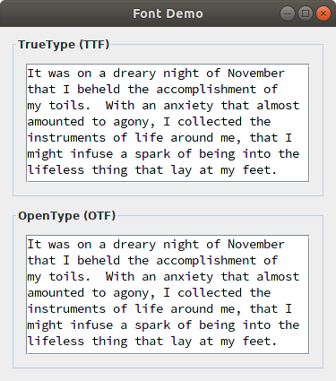

# Screenshots

If the FreeType client fails to set the LCD filter when the ClearType methods are enabled, we get severe color fringes in the rendered text. If the client sets the default LCD filter when the ClearType methods are enabled, we get ClearType-style subpixel rendering with a filter applied to remove the color fringes. In FreeType version 2.8.1 and later when the ClearType methods are disabled, we get the new *Harmony* subpixel rendering, equal in quality to ClearType but with no requirement for the application to set the LCD filter.

| ClearType Enabled, No Filter | ClearType Enabled, Default Filter |
|:----------------------------:|:---------------------------------:|
|  |  |
| ClearType-style rendering with severe color fringes | ClearType-style rendering with filtered colors |

| ClearType Disabled |
|:------------------:|
|  |
| FreeType 2.8.1 Harmony rendering (filter ignored) |

| Details Scaled by 800 Percent |
|:----------------------------:|
|  |
| **ClearType Enabled, No Filter:** ClearType-style rendering with severe color fringes |
|  |
| **ClearType Enabled, Default Filter:** ClearType-style rendering with filtered colors |
|  |
| **ClearType Disabled:** FreeType 2.8.1 Harmony rendering (filter ignored) |
